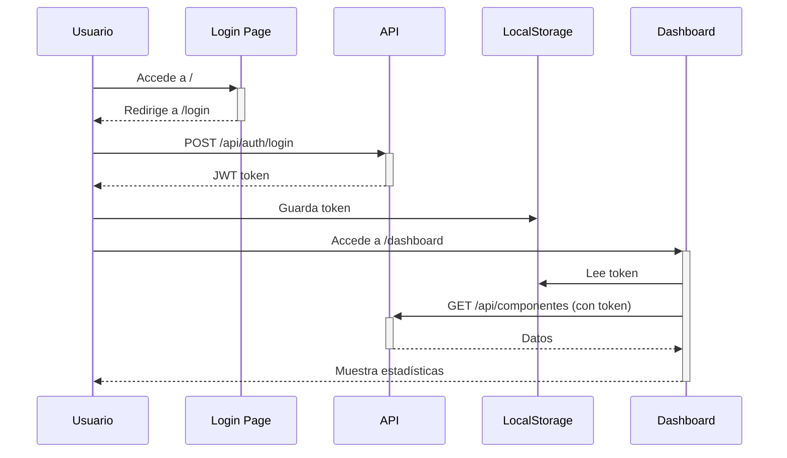

# 🎨 Frontend con Thymeleaf

Frontend básico integrado con Spring Boot usando **Thymeleaf + HTML + CSS + JavaScript**.

## ✅ Características Implementadas

### 📄 Páginas Creadas

1. **Login/Register** (`/login`)
   - Formulario de inicio de sesión
   - Registro de nuevos usuarios
   - Tabs para cambiar entre login/register
   - Validación de formularios
   - Manejo de errores

2. **Dashboard** (`/dashboard`)
   - Estadísticas generales
   - Total de componentes, placas, solicitudes
   - Actividad reciente
   - Navegación rápida

3. **Componentes** (`/componentes`)
   - Listado completo de componentes
   - Crear, editar y eliminar componentes
   - Filtros por nombre y categoría
   - Indicador de stock bajo
   - Modal para formularios

4. **Placas** (`/placas`)
   - Listado de diseños de placas
   - Crear placas con múltiples componentes
   - Relación ManyToMany con componentes
   - Ver detalle de componentes por placa
   - Editar y eliminar placas

### 🎨 Diseño y UX

- **Sidebar** fijo con navegación
- **Diseño responsive** (adaptable a móviles)
- **Tema moderno** con gradientes y sombras
- **Notificaciones** temporales para feedback
- **Modales** para formularios
- **Badges** de estado coloridos
- **Loading states** mientras carga datos

### 🔐 Seguridad

- **JWT** almacenado en localStorage
- **Auto-redirección** a /login si no está autenticado
- **Token en headers** de todas las peticiones API
- **Logout** limpia datos de sesión
- **Refresh automático** de datos cada 30s (dashboard)

## 🚀 Cómo Usar

### 1. Iniciar el Backend

```bash
# Con Maven
./mvnw spring-boot:run

# O con Docker
docker-compose up
```

### 2. Abrir en el Navegador

```
http://localhost:8081
```

Serás redirigido automáticamente a `/login`.

### 3. Crear un Usuario

**Opción A:** Usar el formulario de registro
- Click en "Registrarse"
- Llenar formulario
- Seleccionar rol (ADMIN, OPERADOR, CLIENTE)
- Click en "Crear Cuenta"

**Opción B:** Usar usuario de prueba (si ejecutaste init-scripts)
```
Usuario: admin
Password: password123
```

### 4. Explorar las Funcionalidades

1. **Dashboard**: Ver estadísticas generales
2. **Componentes**: 
   - Click en "+ Nuevo Componente"
   - Llenar formulario
   - Guardar
   - Editar o eliminar componentes existentes
3. **Placas**:
   - Click en "+ Nueva Placa"
   - Agregar componentes con cantidades
   - Guardar
   - Ver detalle de placas

## 📁 Estructura de Archivos

```
src/main/
├── java/com/bootcamp/inventario/
│   └── controller/
│       └── ViewController.java          # Controlador MVC
│
└── resources/
    ├── templates/                        # Vistas Thymeleaf
    │   ├── login.html                   # Login/Register
    │   ├── dashboard.html               # Dashboard
    │   ├── componentes.html             # CRUD Componentes
    │   └── placas.html                  # CRUD Placas
    │
    └── static/                          # Recursos estáticos
        ├── css/
        │   └── styles.css               # Estilos globales
        └── js/
            └── api-client.js            # Cliente API REST
```

## 🔧 Tecnologías Usadas

| Tecnología | Uso |
|------------|-----|
| **Thymeleaf** | Motor de templates HTML |
| **HTML5** | Estructura de páginas |
| **CSS3** | Estilos y diseño |
| **JavaScript** | Lógica cliente + consumo API |
| **Fetch API** | Peticiones HTTP asíncronas |
| **LocalStorage** | Almacenamiento de token JWT |

## 🎯 Flujo de Autenticación



## 🔌 Consumo de API REST

Todas las páginas usan `api-client.js` que proporciona:

```javascript
// GET request con autenticación
const componentes = await apiGet('/api/componentes');

// POST request
const newComp = await apiPost('/api/componentes', data);

// PUT request
const updated = await apiPut('/api/componentes/1', data);

// DELETE request
await apiDelete('/api/componentes/1');

// Upload file
await apiPostFile('/api/upload', file);
```

**Auto-manejo de:**
- ✅ Token JWT en headers
- ✅ Redirección a /login si 401
- ✅ Conversión JSON
- ✅ Manejo de errores

## 📝 Páginas Pendientes (Opcional)

Si quieres ampliar el frontend, faltan estas páginas:

- [ ] `solicitudes-mecanizado.html` - Gestión de solicitudes de mecanizado
- [ ] `solicitudes-armado.html` - Gestión de solicitudes de armado
- [ ] `tareas.html` - Gestión de tareas de operadores

Todas seguirían el mismo patrón de `componentes.html` y `placas.html`.

## 🐛 Troubleshooting

### Error: "No autorizado" / Redirecciona a login constantemente

**Causa:** Token expirado o inválido

**Solución:**
1. Abre DevTools (F12)
2. Application → Local Storage → localhost:8081
3. Elimina `token`, `username`, `email`, `role`
4. Recarga la página y vuelve a hacer login

### Error: "Error de conexión"

**Causa:** Backend no está corriendo

**Solución:**
```bash
# Verificar si Spring Boot está corriendo
curl http://localhost:8081/actuator/health

# Si no responde, iniciar backend
./mvnw spring-boot:run
```

### Error: "Failed to fetch"

**Causa:** CORS o URL incorrecta

**Solución:**
1. Verificar que `CorsConfig.java` permite `http://localhost:8081`
2. Verificar que `api-client.js` usa `API_BASE_URL = ''` (mismo dominio)

### Los estilos no cargan

**Causa:** Spring Security bloqueando `/css/**`

**Solución:** Ya está configurado en `SecurityConfig.java`:
```java
.requestMatchers("/css/**", "/js/**").permitAll()
```

## 📚 Recursos de Aprendizaje

- [Thymeleaf Docs](https://www.thymeleaf.org/documentation.html)
- [Fetch API MDN](https://developer.mozilla.org/es/docs/Web/API/Fetch_API)
- [JWT.io](https://jwt.io/)
- [Spring Boot + Thymeleaf](https://spring.io/guides/gs/serving-web-content/)

## 🎉 Demo Rápido

**5 minutos para probar el frontend:**

1. Inicia el backend: `./mvnw spring-boot:run`
2. Abre: `http://localhost:8081`
3. Register: username=`demo`, email=`demo@test.com`, password=`123456`, role=`ADMIN`
4. Login con las credenciales
5. En Componentes, crea: 
   - Resistencia 10kΩ (stock: 100)
   - LED Rojo (stock: 50)
6. En Placas, crea:
   - Nombre: "LED Simple"
   - Componentes: Resistencia (1), LED (1)
7. ✅ Listo! Ya tienes el sistema funcionando

---

**Frontend creado por:** GitHub Copilot  
**Integrado con:** Sistema de Inventario de Componentes Electrónicos  
**Stack:** Spring Boot 3 + Thymeleaf + JavaScript Vanilla
